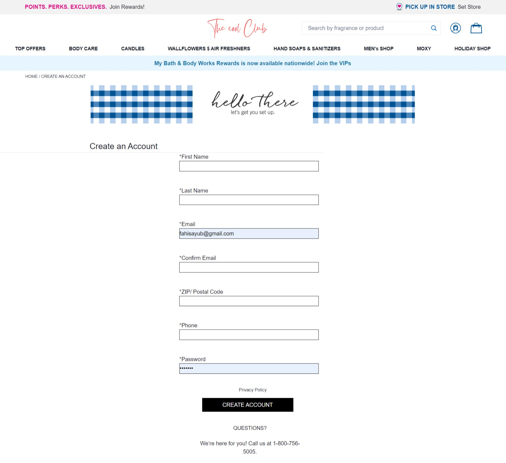
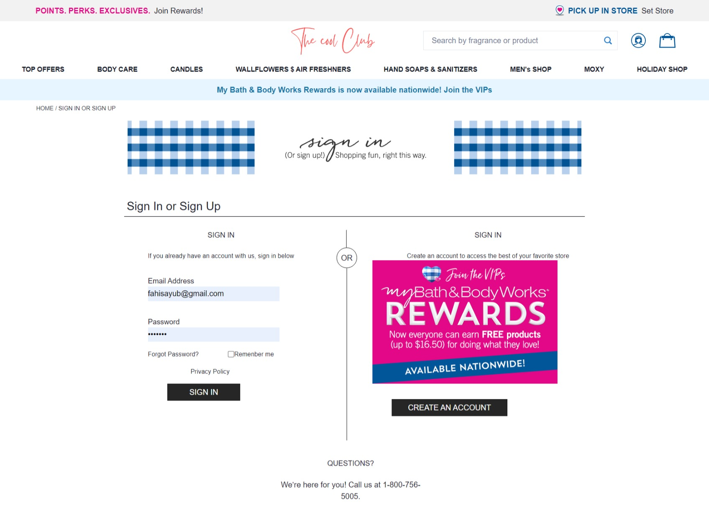
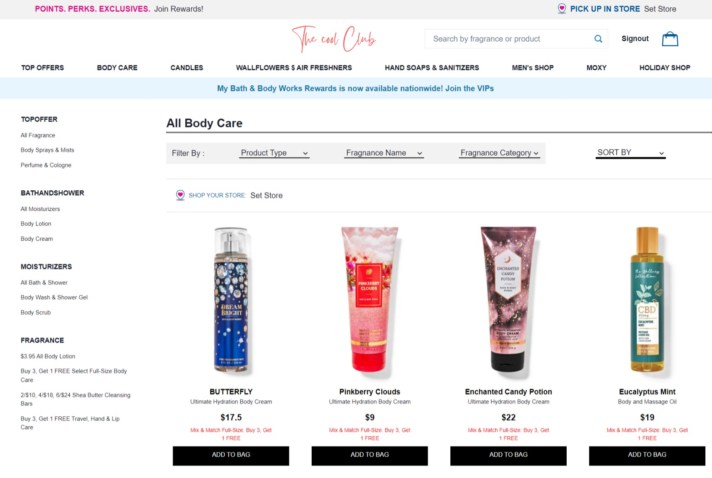
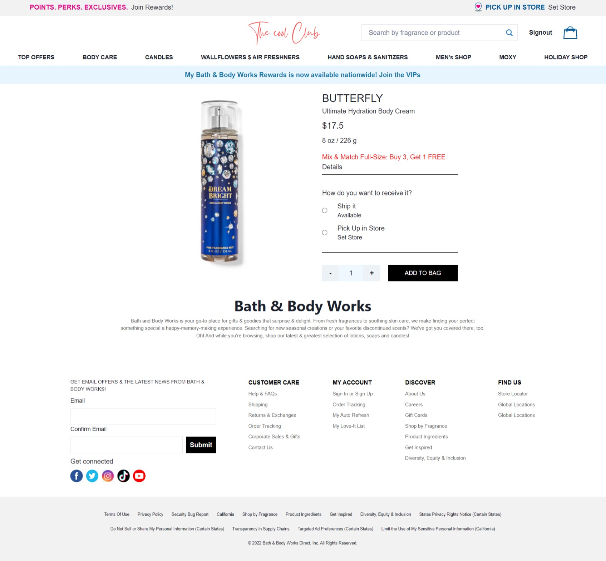
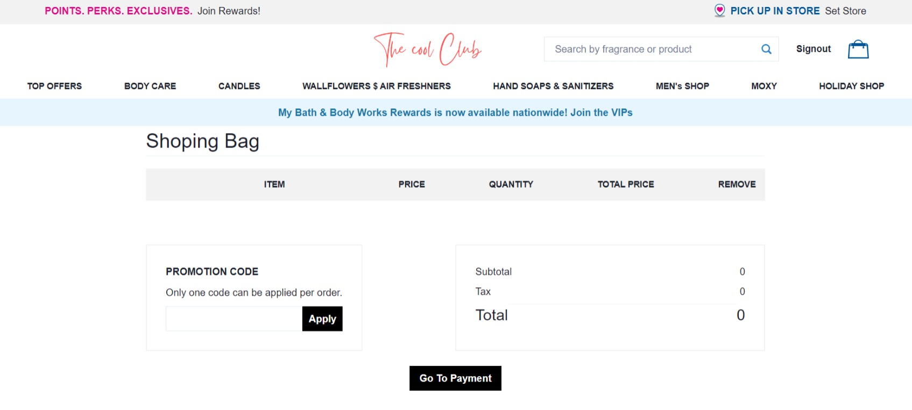
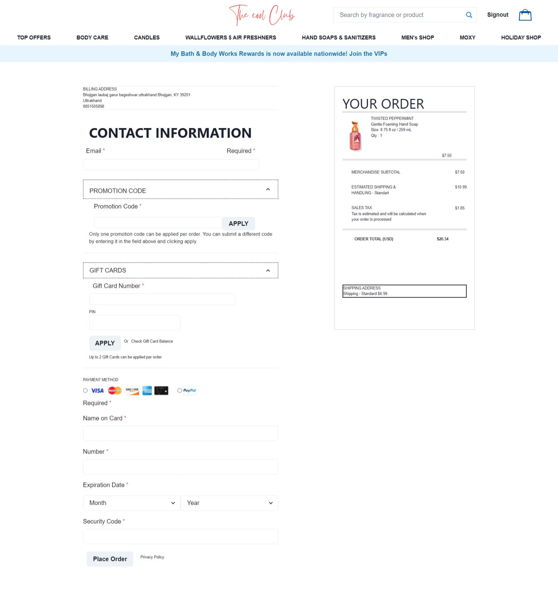

# The Cool Club website

## About Project

The Cool Club is a website that sells body care products which is inspired by th original website Bath & Body Works. Which is an international company that sells personal care and beauty products in more than 1,700 North American stores and has nearly 300 stores in countries around the globe operating under franchise, license and wholesale arrangements.

## Deployed Links

- Frontend Deployed Link=> https://bnbtempdep-akshay-puranik.vercel.app/
- Backend Deployed Link=> https://thecoolclub.onrender.com/

## Tech Stacks and Libraries

- React
- Node.js
- Express
- MongoDB
- Chakra-UI
- redux
- redux-thunk
- react-router-dom
- axios
- bcrypt
- jsonwebtoken
- mongoose

## Pages and Features

### Home Page

### Signup Page

### Login Page

### Products Page

### Single Product Page

### Cart Page

### Checkout Page

### Backend Apis

#### User

- **/user/singup**       ( create new user)
- **/user/login**       (login user)
- **/user/profile**        (view profile)
- **/user/profile/update**                (update user profile)

#### Products

- **/products/**          (get products  )
- **/products/create**           (add product,admin only)
- **/products/:id**        (singleproduct)
- **/products/:id**        (update ,admin only)
- **/products/:id**        (delete,admin only)

#### Cart

- **/cart/**     (get cart items)
- **/cart/addtocart**    (add to cart)
- **/cart/:id**    (delete)

#### Orders

- **/myorders/**     (get)
- **/myorders/create**           (add orders)
- **/myorders/:id**        (update)
- **/myorders/:id**        (delete)

#### Reviews

- **/reviews/:productid**     (get reviews)
- **/reviews/:productid**     (no of reviews)
- **/reviews/:productid**     (no of starts)
- **/reviews/create**     (add review)
- **/reviews/:id**     (update)
- **/reviews/:id**     (delete)

#### Payment methods

- **/paymentmethod/**          (get paymentmethod)
- **/paymentmethod/create**                (add paymentmethod)
- **/paymentmethod/:id**             (update)
- **/paymentmethod/:id**             (delete)

#### Delivery address

- **/deliveryAddress/**            (get deliveryAddress)
- **/deliveryAddress/:id**               ( get single deliveryAddress)
- **/deliveryAddress/create**                  (add deliveryAddress)
- **/deliveryAddress/:id**               (update deliveryAddress)
- **/deliveryAddress/:id**               (delete deliveryAddress)

#### Billing address

- **/billingAddress/**           (get billingAddress)
- **/billingAddress/create**                 (add billingAddress)
- **/billingAddress/:id**              (single billingAddress)
- **/billingAddress/:id**              (update billingAddress)
- **/billingAddress/:id**              (delete billingAddress)

## Team Members

- Akshay Puranik
- Avdhoot Kailas Kurhe
- Muhammed Fahiz
- Pankaj Singh Sajwan (Team Lead)
- Unnikrishnan
